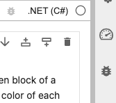
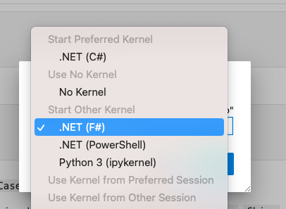
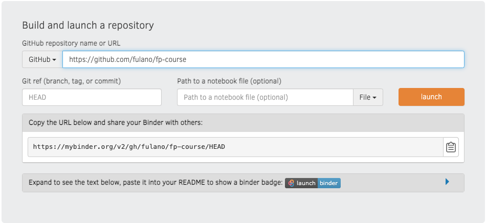

#  Hacé F# tu primer lenguaje  de programación funcional

>If you are interested in the english version, see [README.md](https://github.com/fcolavecchia/fp-course-public/blob/main/README.md)
> 
## Acerca del curso

Estas guías están orientadas a aquellos programadores interesados en aprender algunos conceptos de programación funcional desde una perspectiva práctica. F# es un excelente primer lenguaje de programación funcional: es funcional (por supuesto), tiene una sintaxis limpia y legible (sin muchos símbolos llamativos o raros), es flexible (en caso de que necesites comprender algún otro paradigma en medio de tu código) y es lo suficientemente conciso como para expresar tus ideas con claridad.

Aprender un nuevo lenguaje y un nuevo paradigma de programación es una aventura maravillosa. No necesitas ninguna preparación especial, aunque asumo que el lector tiene cierta experiencia en al menos un lenguaje popular (digamos C, Python, Java o JavaScript, por ejemplo).

Estas guías están escritas completamente como Jupyter Notebooks. Sí, es posible ejecutar F# en un entorno interactivo de notebooks, lo cual es fantástico para aprender.

El curso comienza con la programación funcional, luego se adentra en F# y finalmente se presenta .NET como una biblioteca vasta y útil. _¡No se necesita experiencia previa en el ecosistema .NET!_ 

El curso está enfocado en comprender el lado funcional de F#. De manera intencionada, dejé de lado muchas posibilidades que el lenguaje ofrece, para mantenerse enfocado en el núcleo del curso. Con suerte, algunas de ellas podrán ser revisitadas en lecciones más avanzadas, por escribirse.

> Si necesitas el curso en otro idioma, puedes usar [nbTranslate](https://jupyter-contrib-nbextensions.readthedocs.io/es/latest/nbextensions/nbTranslate/README.html), una extensión de Jupyter Notebooks (Jupyter notebook extension) que crea notebooks multilingües traduciendo el contenido usando Google Translate. Sigue las instrucciones en esos sitios para hacerlo funcionar.

> Intenté hacer referencia a todo el material a sus respectivos autores. Si encuentras algún trabajo tuyo sin referencia, avísame y lo incluiré con gusto.

## Inicio rápido

El curso está estructurado como una colección de [Jupyter Notebooks Políglotas](https://devblogs.microsoft.com/dotnet/announcing-polyglot-notebooks-harness-the-power-of-multilanguage-notebooks-in-visual-studio-code/).
Un [Jupyter Notebook](https://jupyter.org/) es una aplicación sencilla que permite ejecutar bloques de código en celdas, que pueden entrelazarse con texto, gráficos, matemáticas, etc. El cuaderno se conecta a un _kernel_ que se encarga de ejecutar el código, y se ejecuta en un navegador web. El lenguaje más popular utilizado en los notebooks es Python, sin embargo, se pueden usar muchos lenguajes diferentes. Un cuaderno políglota incluye la posibilidad de ejecutar varios lenguajes, entre ellos F#.

Para ejecutar las lecciones tal como están, simplemente abre este repositorio en MyBinder:

Dale un poco de tiempo y esto abrirá los cuadernos en tu navegador web.

Abre el que prefieras, verifica que el `Kernel` en el lado derecho esté correctamente seleccionado:

Detectará automáticamente .NET C#, 

pero ese no es el lenguaje que estás buscando:

Y estás listo para comenzar.

### Haz tu copia (Fork it)

Si quieres experimentar con las guías, hacer los ejercicios, etc., es mejor obtener tu propia copia de este repositorio haciendo [fork](https://github.com/fcolavecchia/fp-course-public).

#### Usando Binder para ejecutar tu repositorio

Una vez que hagas fork del repositorio, ve a [MyBinder](https://mybinder.org/). Llegarás a esta página:

Copia la URL de tu repositorio bifurcado en el campo `GitHub`, y puedes dejar en blanco los campos `Git ref` y `Path to a notebook`. Haz clic en `launch`` y espera un momento hasta que MyBinder haga su magia.

Una vez abierto el Binder, haz clic en el directorio `es` (en español) o `en` (versión en inglés) en el panel izquierdo, y verás todos los cuadernos disponibles.

Sigue las instrucciones anteriores para seleccionar el kernel de F#.

### Instalando cuadernos políglotas para ejecutar en tu propia computadora

Si deseas experimentar con los cuadernos en tu propia computadora, necesitas instalar la [extensión políglota para VS Code](https://marketplace.visualstudio.com/items?itemName=ms-dotnettools.dotnet-interactive-vscode). Sigue las instrucciones allí para hacer que todo funcione sin conexión.

## ¡No quiero usar los notebooks!

¡No hay problema! Simplemente copia y pega los códigos de los cuadernos del repositorio en el [Fable REPL](https://fable.io/repl/), que es un compilador de F# en línea. Solo escribe tu código en el panel izquierdo, haz clic en el botón de reproducción habitual (o Alt+Enter) y eso es todo, ¡estarás programando en F#!

## Content

### [Una introduction a F#](https://github.com/fcolavecchia/fp-course-public/blob/main/es/00_Intro.ipynb)

### Funciones 
  
- [Fundamentos](https://github.com/fcolavecchia/fp-course-public/blob/main/es/01_Fundamentals.ipynb)
- [Funciones](https://github.com/fcolavecchia/fp-course-public/blob/main/es/02_Functions.ipynb)
- [Ejercicios](https://github.com/fcolavecchia/fp-course-public/blob/main/es/03_Exercises.ipynb)
- [Más sobre Funciones](https://github.com/fcolavecchia/fp-course-public/blob/main/es/10_MoreOnFunctions.ipynb)  

### Types

- [Una introducción a tipos](https://github.com/fcolavecchia/fp-course-public/blob/main/es/11_IntroToTypes.ipynb)        
- [Uniones discriminadas](https://github.com/fcolavecchia/fp-course-public/blob/main/es/12_DiscriminatedUnions.ipynb) 
- [Records](https://github.com/fcolavecchia/fp-course-public/blob/main/es/13_Records.ipynb)
- [Ejercicios](https://github.com/fcolavecchia/fp-course-public/blob/main/es/14_Exercises.ipynb)

### Control Flow 

- [Manejando el código con `if`, recursión and _pattern matching_](https://github.com/fcolavecchia/fp-course-public/blob/main/es/20_ControlFlow.ipynb)      
- [Ejercicios](https://github.com/fcolavecchia/fp-course-public/blob/main/es/21_Exercises.ipynb)  

### De las colecciones 

- [Colecciones heterogéneas](https://github.com/fcolavecchia/fp-course-public/blob/main/es/30_Tuples.ipynb)
- [Colecciones homogéneas](https://github.com/fcolavecchia/fp-course-public/blob/main/es/31_OnCollections.ipynb) 
- [Ejercicios](https://github.com/fcolavecchia/fp-course-public/blob/main/es/33_Exercises.ipynb)

### Más sobre colecciones 

- [Más sobre colecciones](https://github.com/fcolavecchia/fp-course-public/blob/main/es/40_MoreOnCollections.ipynb)
- [Diccionarios](https://github.com/fcolavecchia/fp-course-public/blob/main/es/41_Maps.ipynb)
- [Ejercicios](https://github.com/fcolavecchia/fp-course-public/blob/main/es/43_Exercises.ipynb)

### Managing Errors 

- [Excepciones](https://github.com/fcolavecchia/fp-course-public/blob/main/es/42_Exceptions.ipynb)
- [El tipo `Result`](https://github.com/fcolavecchia/fp-course-public/blob/main/es/50_Results.ipynb)

### [Unidades de medida](https://github.com/fcolavecchia/fp-course-public/blob/main/es/51_Units.ipynb) 

### Intermezzo: [Un _kata_ clásico](https://github.com/fcolavecchia/fp-course-public/blob/main/es/53_Exercises.ipynb)

### [Una vuelta más sobre colecciones](https://github.com/fcolavecchia/fp-course-public/blob/main/es/60_YetAnotherTakeOnCollections.ipynb)

### Intermezzo: [Ejercicios](https://github.com/fcolavecchia/fp-course-public/blob/main/es/63_Exercises.ipynb) 

### Input/Output 
  
- [Fundamentos](https://github.com/fcolavecchia/fp-course-public/blob/main/es/61_IO.ipynb)
- [Volviendo a la máquina expendedora](https://github.com/fcolavecchia/fp-course-public/blob/main/es/70_VendingMachineReadFood.ipynb)
- [Ejercicios](https://github.com/fcolavecchia/fp-course-public/blob/main/es/73_Exercises.ipynb) 

### Procesando archivos de datos estructurados
- [Type Providers](https://github.com/fcolavecchia/fp-course-public/blob/main/es/80_TypeProviders.ipynb)
- [Ejercicios](https://github.com/fcolavecchia/fp-course-public/blob/main/es/83_Exercises.ipynb) 
  
### Bienvenido a .NET! 
- [Proyectos y soluciones en .NET](https://github.com/fcolavecchia/fp-course-public/blob/main/es/90_Dotnet.ipynb)
- [Ejercicios](https://github.com/fcolavecchia/fp-course-public/blob/main/es/93_Exercises.ipynb)

### Tests
- [Fundamentos](https://github.com/fcolavecchia/fp-course-public/blob/main/es/A0_Tests.ipynb) 
- [Ejercicios](https://github.com/fcolavecchia/fp-course-public/blob/main/es/A3_Exercises.ipynb) 

### Coda: Más ejercicios  

- [El _Kata_ de la Rosa Dorada](https://github.com/fcolavecchia/fp-course-public/blob/main/es/B_GildedRose.ipynb)
- [Advent of Code, día 2](https://github.com/fcolavecchia/fp-course-public/blob/main/es/C_AdventOfCodeDay2.ipynb)
- [Juegos de Terminal Frost Inc.](https://github.com/fcolavecchia/fp-course-public/blob/main/es/F_inal_2023.ipynb)

Si estás fuera de Argentina, 

En Argentina ([⭐️⭐️⭐️](https://www.google.com/search?sxsrf=AB5stBhaoXbELdiYcGYn7LFGYKB5MFJghw:1689278838922&q=tapas+diarios+argentina+campeon&tbm=isch&source=univ&fir=qHsD8jNqiBcR9M%252CU5M3nzbfNCNn8M%252C_%253B7lmgd4_tqxBr0M%252CTb5831L19eaXcM%252C_%253Bxkamwj7oGERHKM%252CTb5831L19eaXcM%252C_%253Bf811CjKb2LLh7M%252C6IbX8QPfQ6R-DM%252C_%253BvmanPOo9DcX_oM%252Cf5SKLsrn8UfPGM%252C_%253BG3kgOTfPZp1rEM%252CU5M3nzbfNCNn8M%252C_%253ByAGLp8C-7HBuaM%252Cf5SKLsrn8UfPGM%252C_%253BE1ymLFohpM5KnM%252CNUdpLYYeU0KINM%252C_%253BItgEyKk9MEK-bM%252CTb5831L19eaXcM%252C_%253Bmen7RXX3I3w1JM%252CqckwzAwT3VRJQM%252C_%253B6YT2RZN5uLw1BM%252CMfkxFsfwjq9IsM%252C_%253BdcLhUOM3R1ox_M%252Cf5SKLsrn8UfPGM%252C_%253B6it-AccCwiaQDM%252CNTrBj-F-R3FTuM%252C_%253Bdk-DC8MACwI8RM%252CBm6aDjdldCzeKM%252C_%253BMiSESfwPCDZDVM%252C6IbX8QPfQ6R-DM%252C_%253Bw6MLsP6bc25E5M%252CmR8TtUtR6UUpvM%252C_%253B7YN4ps_NYgQ57M%252CNUdpLYYeU0KINM%252C_%253BJb_wAw717kA0CM%252Ce2JcT5Tr2HlqvM%252C_&usg=AI4_-kSS5BeL8NRNJld05TDcYoXr3u9QXQ&sa=X&ved=2ahUKEwirhPuIvoyAAxUNpJUCHeYpB5gQjJkEegQIDhAC&biw=1808&bih=1276&dpr=2))

